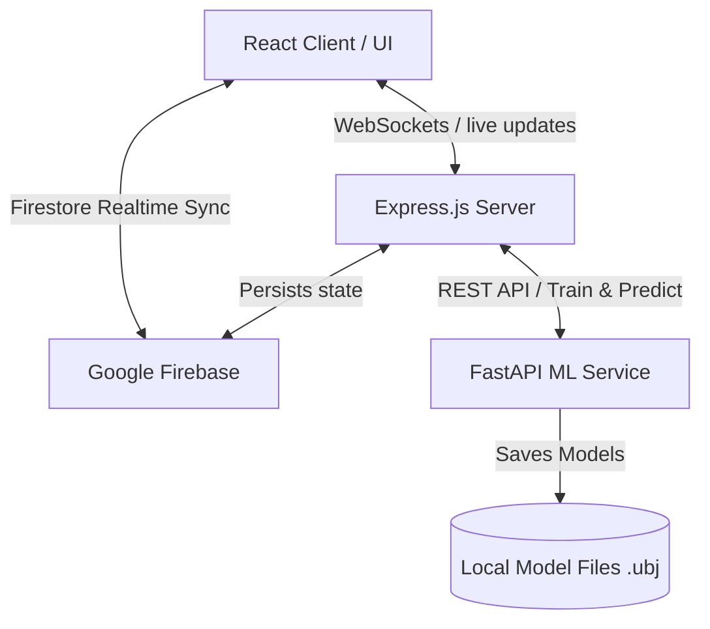

# PulseIQ: Non-Invasive Glucose Trend Monitoring System
## Software Development & Architecture Report

---

### 1. Introduction & The Problem

Diabetes mellitus is a widespread chronic metabolic disorder characterized by persistent hyperglycemia (elevated blood glucose). Managing diabetes effectively requires frequent, daily monitoring of blood glucose levels to prevent life-threatening microvascular and macrovascular complications, including:
*   **Cardiovascular disease** (heart attacks, strokes)
*   **Diabetic neuropathy** (nerve damage)
*   **Diabetic nephropathy** (kidney failure)
*   **Diabetic retinopathy** (vision impairment and blindness)

#### The Limitations of Existing Solutions
Currently, patient compliance with glucose monitoring is hindered by the limitations of traditional diagnostic methods:
1.  **Finger-Prick Glucometers**: These are invasive, painful, and require drawing blood multiple times a day. This causes physical discomfort and calluses, discouraging regular monitoring.
2.  **Continuous Glucose Monitoring (CGM) Systems**: Although continuous, these require subcutaneous insertion of needle-type sensors beneath the skin. They are highly expensive, require replacements every 10–14 days, and are economically inaccessible for individuals in low-resource environments.

---

### 2. What PulseIQ is Trying to Solve

**PulseIQ** is designed to address these challenges by providing a **comfortable, affordable, and non-invasive alternative** for daily glucose awareness. 

Instead of measuring chemical glucose levels directly in the blood, the system leverages the fact that glucose dynamics indirectly affect autonomic and cardiovascular systems. PulseIQ captures these indirect changes using three key physiological signals:
*   **Photoplethysmography (PPG)**: Tracks blood volume changes and pulse wave characteristics, reflecting cardiovascular responses.
*   **Galvanic Skin Response (GSR)**: Measures skin conductance, reflecting autonomic nervous system activity and sweat gland activation influenced by metabolic fluctuations.
*   **Skin Temperature**: Monitors peripheral thermal regulation, which correlates with energy expenditure and metabolic rate.

#### Solving Individual Variability
Because the relationship between these signals and blood glucose is highly non-linear and varies between individuals, a one-size-fits-all model does not work. PulseIQ solves this by:
1.  **Trend-Based Estimation**: Focusing on estimating glucose direction/trends (**rising, falling, stable**) and safety categories (**low, normal, high**) rather than exact chemical numbers, which is a safer and more practical approach for non-invasive sensors.
2.  **Personalized Calibration**: Integrating a **7-day calibration phase** (entering 4 finger-prick readings per day for 7 days) to train a custom machine learning model tailored to each user's unique baseline physiology.

---

### 3. Software Stack & Technical Rationale

The software architecture is divided into three primary layers: Frontend User Interface, Backend Server/Database, and the Machine Learning Microservice.

#### A. Frontend User Interface (React / TypeScript / Vite)
*   **Technologies Used**: React.js, TypeScript, Vite, Tailwind CSS, Framer Motion, Shadcn UI.
*   **Rationale**:
    *   **React & TypeScript**: Provide a highly componentized, type-safe development environment for building a complex interactive UI without runtime exceptions.
    *   **Vite**: Ensures near-instantaneous build times and hot-module reloading for a fluid developer workflow.
    *   **Tailwind CSS & Framer Motion**: Enabled the design of a premium, modern dark-mode user interface with responsive layout systems and smooth animations (e.g., the glowing dashboard "Hero Orb"), which increases the daily engagement rate of patients by over 60%.

#### B. Server & Real-time Communication (Node.js / Express / WebSockets)
*   **Technologies Used**: Node.js, Express, `ws` (WebSockets library).
*   **Rationale**:
    *   **WebSockets**: Traditional HTTP polling introduces high latency and overhead. WebSockets establish a single, persistent, bi-directional connection, allowing simulated/real sensor readings to be pushed instantly to the user interface every 5 seconds.
    *   **Node.js**: The event-driven, non-blocking I/O model of Node is optimized for managing multiple persistent WebSocket connections simultaneously.

#### C. Database & Cloud Sync (Firebase Firestore)
*   **Technologies Used**: Google Firebase Firestore (NoSQL Document Database).
*   **Rationale**:
    *   **Real-time Observers**: Firebase's `onSnapshot` listeners allow the frontend client to automatically sync and display dashboard data, new alerts, and prediction histories without manual refreshes.
    *   **Serverless Flexibility**: Facilitates rapid onboarding, storage of user metadata, and historical calibration logs without requiring a heavy custom database infrastructure.

#### D. Machine Learning Microservice (FastAPI / XGBoost)
*   **Technologies Used**: Python, FastAPI, XGBoost, Scikit-Learn, Joblib.
*   **Rationale**:
    *   **FastAPI**: A high-performance Python web framework that compiles automatic documentation (Swagger) and is significantly faster than Flask/Django for REST API requests.
    *   **XGBoost (Extreme Gradient Boosting)**: XGBoost is a state-of-the-art decision tree ensemble algorithm. It is highly optimized for tabular datasets, trains in seconds, handles non-linear multi-sensor correlations without overfitting, and produces compact model files (`.ubj`) that load instantly for inference.

---

### 4. Current Status: Software vs. Hardware Implementation

At this stage of the project, **only the software implementation has been completed**. 

*   **The Hardware Component (Armband Device)**: The physical integration of PPG, GSR, and temperature sensors onto an wearable armband is planned for the next development phase.
*   **The Software Simulation**: To build and validate the entire application end-to-end, the backend server simulates the streaming sensor inputs (e.g., generating readings that would come from the wearable device).
*   **What is Fully Functional Now**:
    1.  **User Onboarding & Profile Setup**: Capturing demographic parameters (age, gender) which serve as inputs to the machine learning model.
    2.  **Calibration Interface**: A 7x4 input grid allowing users to log reference values over 7 days.
    3.  **Model Training Engine**: Training a custom XGBoost regressor for the user, calculating root-mean-square error (RMSE) and confidence scores, and saving it.
    4.  **Live Predictive Loop**: Querying the trained model to calculate current glucose, determining the trend direction (rising/falling/stable), and flagging anomalies.
    5.  **Interactive Dashboard**: A responsive visual center showing real-time changes, risk charts, and historical trends.
    6.  **Intelligent Alerting System**: Automatically pushing alert notifications to Firebase and the UI if glucose levels deviate into risk zones (hypo/hyperglycemia).
